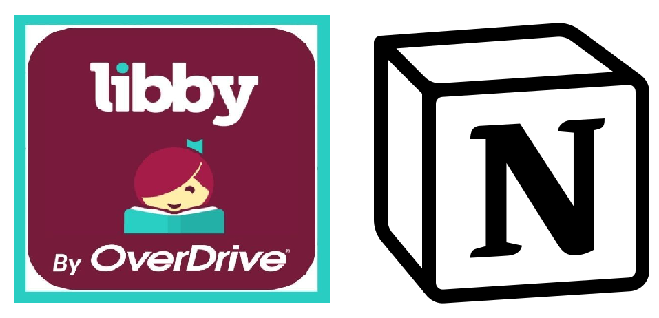
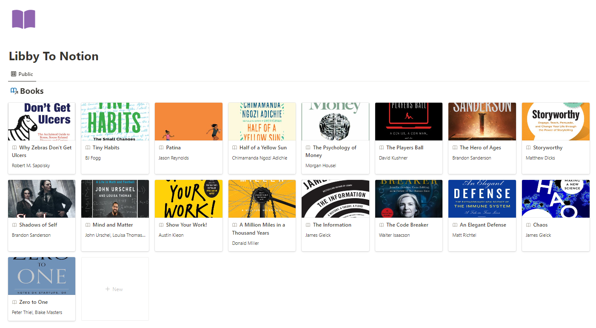

<div align="center">    
 
# Libby To Notion     



</div>

 
## Description   
This project allows you to populate your Notion "Books" database with ebooks / audiobooks borrowed via Libby using the Notion API and the Libby Timeline Export. If you'd like this to happen periodically, run the script `scripts/runLibbyToNotion.sh` at a reasonable frequency using a `crontab` job. 

## Directory Structure

```
.
+-- docs/
|   +-- images/
|   |   +-- demo.png
|   |   +-- icon.png
+-- globalStore/
|   +-- constants.py
+-- lib/
|   +-- port_utils.py
|   +-- utils.py
+-- notebooks/
|   +-- Trial.py
+-- scripts/
|   +-- runLibbyToNotion.sh
+-- secrets/
|   +-- secrets_notion.json
|   +-- secrets_libby.json
+-- src/
|   +-- libbyToNotion.py
+-- tests/
|   +-- testNotionAPI.py
|   +-- testLibbyDataRetrieval.py
+-- .gitignore
+-- juyptext.toml
+-- LICENSE
+-- README.md
+-- requirements.txt
+-- STDOUTlog_examples.txt
```

---

---

## Usage
1. Login to your Libby account in their web app https://libbyapp.com/.
2. Go to the Timeline (modify it as needed) and click `Export Timeline` and choose `Data (json)`. This will take you to an url. Copy the url and add it to `secrets/secrets_libby.json` in the following format:
```
{
    "url": "add the timeline json url here"
}
```
3. Register a private integration on your Notion workspace (follow instructions [online](https://www.notion.so/help/create-integrations-with-the-notion-api#create-an-internal-integration))
4. Obtain its `notionToken`
5. Create a database / choose existing database on Notion to contain all the entries from Libby. Make sure it has the following properties. If you want to add more properties or remove, modify the function `getAllLibbyItems` and `getNotionPageEntryFromProp` in `lib/port_utils.py`.
```
Title property: Name
Text properties: Author, ISBN
Select properties: Status, Format
Date properties: LibbyDate
```
6. Get its `databaseID` and add it to `secrets/secrets_notion.json` in the following format:
```
{
    "notionToken": "your notion token",
    "databaseID": "your notion database ID"
}
```
7. Run the python script `src/libbyToNotion.py` with `--fullLibby` argument as `True`. Note that this will automatically set the `Status` of all items from Libby to be `libby-inbox`. 
8. Currently, the logic takes in all unique borrowed items from the Libby Timeline, gets all the rows from the Notion database, and verifies that items aren't repeated. This can be made more efficient if needed by filtering out only recently added items from the Timeline (set `--fullLibby` to `False` and populating the `else` block which currently shows `NotImplementedError`). But for now, it is simpler to just modify it locally after getting all items from the Timeline on Libby. To do a one time cover update, set argument `--oneTimeCoverUpdate` to `True` and `--fullLibby` to `False`.
9. You can periodically run this file again as a script `scripts/runLibbyToNotion.sh` using a crontab job to get periodic updates. For more information on Crontab, check out this [reference](https://crontab.guru/).


## Sources

- [Libby](https://libbyapp.com/)
- [Notion API Python SDK](https://github.com/ramnes/notion-sdk-py)


## If you use it in your work and want to adapt this code, please consider starring this repo or forking from it!

```
@misc{nanbhas2022_libbyToNotion,
  title={Libby To Notion},
  author={Nandita Bhaskhar},
  journal={GitHub Repo, https://github.com/nanbhas/LibbyToNotion},
  year={2022}
}
``` 
 

